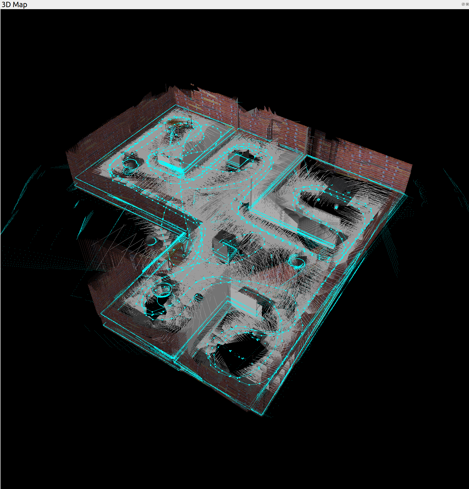
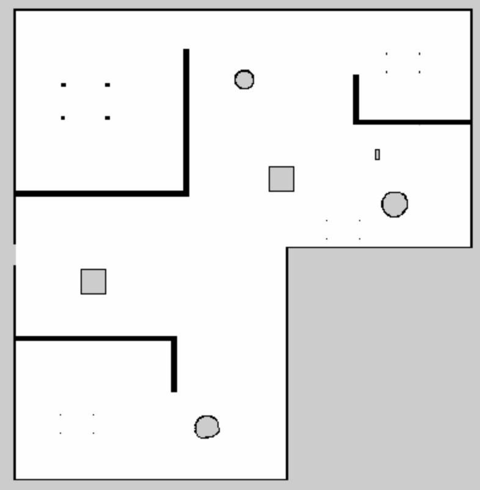
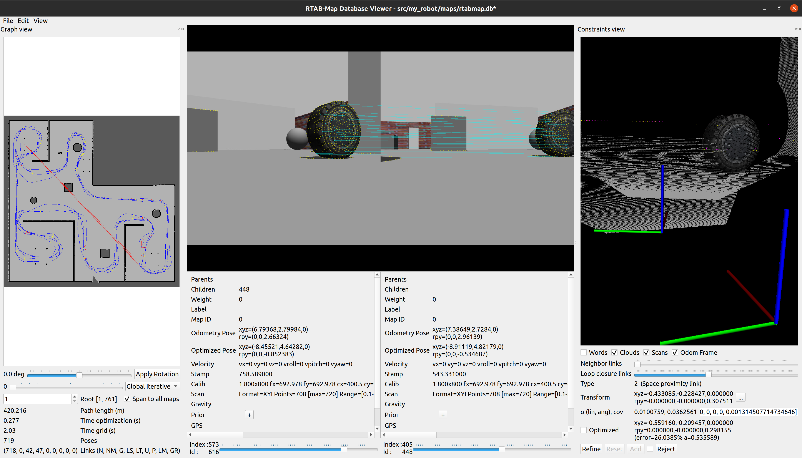
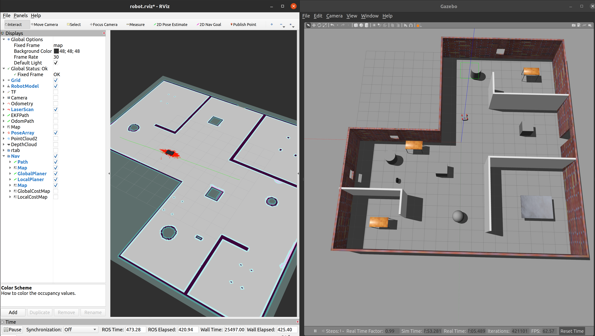

# Project 4: Map My World
### Directory Structure

    .myrobot_ws/ 
    └── src/
        └── my_robot/
            ├── config/
            │    ├── robot.rviz
            │    ├── base_local_planner_params.yaml
            │    ├── costmap_common_params.yaml
            │    ├── global_costmap_params.yaml
            │    └── local_costmap_params.yaml
            ├── images/
            │    ├── 3D_map.png
            │    ├── Map_Localization_Testing_amcl.png
            │    ├── 2D_map.png
            │    ├── robot.png
            │    └── RTAB_MAP_viewer.png
            ├── launch/
            │    ├── amcl.launch
            │    ├── create_trajectory.launch
            │    ├── EKF.launch
            │    ├── gazebo.launch
            │    ├── localization.launch
            │    ├── mapping.launch
            │    ├── ps4_controller.launch // (controlling the robot using a PS4 controller)
            │    ├── robot_pose_ekf.launch
            │    └── world.launch
            ├── maps/
            │    ├── map.pgm
            │    └── map.yaml
            ├── materials/
            │    └── textures/
            │         └── realsense_diffuse.png
            ├── meshes/
            │    ├── hokuyo.dae
            │    └── realsense.dae
            ├── scripts/
            │    └── ps4.py // (controlling the robot using a PS4 controller)
            ├── src/
            │    ├── drive_bot.cpp
            │    └── process_images.cpp
            ├── srv/
            ├── urdf/
            │    ├── colors.xacro
            │    ├── my_robot.gazebo
            │    └── myrobot.urdf.xacro
            ├── worlds/
            │    ├── arche.world
            │    ├── maze.world
            │    ├── wall.world
            │    └── map1
            │         ├── map1.world
            │         ├── model.config
            │         └── map1.sdf
            ├── CMakeLists.txt
            ├── package.xml
            └── README.md


# RTAB_ROS
An application of [rtabmap-ros](http://wiki.ros.org/rtabmap_ros) package for 
simultaneous localization and mapping (SLAM) of a mobile robot. 

<table style="width:100%">
  <tr>
    <th><p>
           </a>
           <br>3D Map
        </p>
    </th>
    <th><p>
           </a>
           <br>2D Map
      </p>
    </th>
  </tr>
  <tr>
    <th><p>
           </a>
           <br>Detected Features
      </p>
    </th>
    <th><p>
           </a>
           <br>Localization Testing
      </p>
    </th>
  </tr>
</table>

## Description
The project consists of the following parts:
1. A Gazebo world and a mobile robot [project](https://github.com/Ahmed-Magdi1/Map-My-World.git).
2. ROS package: [rtabmap-ros](http://wiki.ros.org/rtabmap_ros)

## Prerequisites
1. ROS (noetic) , Gazebo on Linux
2. CMake & g++/gcc
3. Install `rtabmap-ros` package `$ sudo apt-get install ros-noetic-rtabmap-ros`

## Build and Launch

1. Clone project and initialize a catkin workspace
```
$ mkdir catkin_ws && cd catkin_ws
$ git clone https://github.com/Ahmed-Magdi1/Map-My-World.git
$ mv Map-My-World src
```

2. Move back to `catkin_ws\` and build
```
$ catkin_make
```

3. Launch the world and robot
```
$ source devel/setup.bash
$ roslaunch my_robot world.launch
```

4. Open another terminal, and launch the `mapping.launch` file. 
Here, the rtabmap-ros package will be launched.
```
$ source devel/setup.bash
$ roslaunch my_robot mapping.launch
```

5. Open another terminal, and run the `teleop` node.
```
$ rosrun teleop_twist_keyboard teleop_twist_keyboard.py
```

6. Navigate the robot around. Navigate 
the robot to scan its surrounding environment. The rtabmap-ros package will save
the resulted map with the localized trajectory of the robot in a database file 
`~/.ros/rtabmap.db`.

7. Open another terminal, and open up the database file using `rtabmap-databaseViewer`
```
$ rtabmap-databaseViewer ~/.ros/rtabmap.db
```

* Choose View -> Constraints View and Graph View
* To see 3D Map, Choose Edit -> View 3D Map ...
    
You could also open the database I already generated in this project. The number
of loop closures can be found in 


To ensure the localization, run amcl.launch in the AMCL launch file 
```
$ roslaunch my_robot amcl.launch
```


